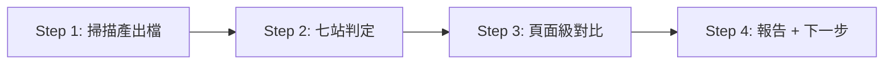

# SDD Status — 管線進度盤點

## 目的

**只做一件事**：唯讀掃描當前 worktree 的七站產出檔，推斷 SDD 管線走到哪一站，輸出狀態表與單一「建議下一步指令」。

**不做**：不建立、不修改任何檔案；不跑測試；不跨 worktree。

## 何時用

- 中斷換 session 接手，想知道這條線走到管線哪一站
- 多 worktree 並行開發，逐線盤點進度
- 跑任何 `/feature-to-*` 前，想確認前置產物齊不齊

## 使用方式

```bash
/sdd-status
```

無參數。

---

## 絕對唯讀（硬規則）

- 不建立、不修改、不刪除任何檔案——console 報告即唯一產出
- 不跑 playwright——green 判定只讀 `.last-run.json` 殘留檔，不主動觸發測試
- 只用相對路徑掃當前 worktree，不跨目錄、不讀其他 worktree
- **模板初始狀態產物全缺是常態**：各站顯示「未開始」即可，不得報錯、不得建議「修復」缺檔

---

## 流程



### Step 1：掃描（唯讀）

一次跑完所有存在性檢查（用 `find` 不用 shell glob——zsh 下 glob 沒命中會噴 no matches found；空輸出屬正常，不是錯誤）：

```bash
find spec/gherkin-feature -name '*.feature' 2>/dev/null
find spec/e2e-flows -name '*.flow.md' 2>/dev/null
ls spec/report/route-map.yaml spec/report/sync-report.md 2>/dev/null
find app/types/api -name '*.ts' 2>/dev/null
find server/api server/mock -type f 2>/dev/null
find app/api -name '*.api.ts' 2>/dev/null
find test/e2e/specs -name '*.spec.ts' 2>/dev/null
cat test/e2e/test-results/.last-run.json 2>/dev/null
```

若 `spec/report/route-map.yaml` 存在，另讀其 `routes` 區塊（`path` + `page` 欄位）供 Step 3 對比。

### Step 2：七站判定

| # | 站 | 判定依據 | 完成 | 部分 | 未開始 |
|---|-----|----------|------|------|--------|
| 1 | 規格置入 | `spec/gherkin-feature/*.feature`（含 `.dsl.feature`） | 有任一 | — | 無 |
| 2 | Flow | `spec/e2e-flows/*.flow.md` | 有 feature flow | 僅 `_common.flow.md` | 無 |
| 3 | API 合約 | `spec/report/route-map.yaml` ＋ `app/types/api/*.ts` | 兩者皆有 | 僅其一 | 皆無 |
| 4 | Mock/Server | `server/api/`、`server/mock/` 有檔 | 兩目錄皆有 | 僅一邊 | 皆無 |
| 5 | Client API | `app/api/*.api.ts` | 有 | — | 無 |
| 6 | 主 spec | `test/e2e/specs/*.spec.ts` | 有 | — | 無 |
| 7 | UI/Green | route-map `routes` vs `app/pages/` ＋ `.last-run.json` | 頁面全齊且 last-run passed | 頁面全齊但未跑／failed，或僅部分頁面存在 | route-map 缺，或無任何對應頁面 |

判定細則：

- **站 2**：`_common.flow.md` 是共用流程，不計 feature flow，存在時在依據欄單獨標示「含 _common.flow.md（共用流程）」
- **站 3**：`app/types/api/_schema.d.ts` 是模板自帶的 openapi-typescript 基建骨架，**不計為產物**；只計其他 `*.ts` 型別檔
- **站 7 green**：`test/e2e/test-results/.last-run.json` 是 Playwright 最近一次執行的殘留檔，`status` 為 passed/failed；**檔案不存在＝未跑過**。頁面未全齊時 green 僅供參考、不影響站別判定

### Step 3：頁面級對比（站 7 展開）

`route-map.yaml` 存在時才做：逐條取 `routes[].page` 檢查實檔是否存在，列「已實作／待實作」兩類。route-map 缺時站 7 依據標「無 route-map.yaml 可對比」，不列頁面表。

### Step 4：輸出報告

```
=== SDD Status ===

| # | 站 | 狀態 | 判定依據 |
|---|-----|------|----------|
| 1 | 規格置入 | ✅ 完成 | spec/gherkin-feature/ 有 2 個 .feature |
| 2 | Flow | ⬜ 未開始 | spec/e2e-flows/ 無 .flow.md |
| 3 | API 合約 | 🟡 部分 | route-map.yaml 存在；app/types/api/ 無型別檔（_schema.d.ts 骨架不計） |
| 4 | Mock/Server | ⬜ 未開始 | server/api/、server/mock/ 無檔 |
| 5 | Client API | ⬜ 未開始 | app/api/ 無 *.api.ts |
| 6 | 主 spec | ⬜ 未開始 | test/e2e/specs/ 無 .spec.ts |
| 7 | UI/Green | ⬜ 未開始 | 無 route-map.yaml 可對比 |

頁面進度（route-map 存在時才列）：
| route | 頁面 | 狀態 |
|-------|------|------|
| /login | app/pages/login.vue | ✅ 已實作 |
| /teams | app/pages/teams/index.vue | ⬜ 待實作 |
green：.last-run.json status=passed（頁面未全齊，僅供參考）

⚠️ Sync 進行中（spec/report/sync-report.md 存在）

下一步：`/feature-to-flow`（產出 .flow.md）
```

- `⚠️ Sync 進行中` 一行只在 `spec/report/sync-report.md` 存在時顯示，不展開內容
- 「下一步」**只輸出一行**，不列多個選項

---

## 下一步決策表

取**最早狀態非「完成」的站**，對應建議：

| 最早未完成站 | 建議下一步 |
|--------------|------------|
| 1 規格置入 | 下一步：置入 `.feature` 到 `spec/gherkin-feature/` 後跑 `/feature-to-flow` |
| 2 Flow | 下一步：`/feature-to-flow`（產出 .flow.md） |
| 3 API 合約 | 下一步：`/feature-to-api`（Phase 0 產出型別與 route-map） |
| 4 Mock/Server | 下一步：`/feature-to-api 1`（產出 mock data + server 端點） |
| 5 Client API | 下一步：`/feature-to-api 1.5`（產出 client 包裝層） |
| 6 主 spec | 下一步：`/test e2e`（偵測 E2E 狀態並產出執行計畫） |
| 7 頁面未齊 | 下一步：`/feature-to-ui`（為通過 spec 建 UI） |
| 7 頁面齊、green 未過或未跑 | 下一步：`/test e2e green auto`（修 UI 直到 spec 全過） |
| 七站全完成 | 下一步：有 vibe 改動先跑 `/vibe-check`，否則 `/commit` |

---

## 與相關 skill 的關係

```
/sdd-status     （這個 skill）唯讀盤點七站進度，指出下一站
   ↓ 依建議執行
/feature-to-flow → /feature-to-api → /test e2e → /feature-to-ui → /test e2e green
```

/sdd-status 不會自動呼叫任何下游指令，只報告與建議；產物的產生與修改由各站 skill 負責。
