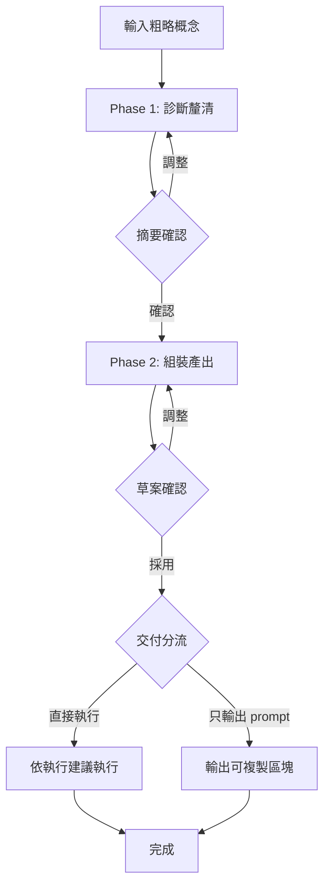

# Sharpen

把一句粗略概念磨成可直接執行的精準指令＋執行方式建議。僅以 `/sharpen` 手動觸發。
定位：把「寫高品質交接 prompt」的標準，自動套用到手打短 prompt 上。

## 輸入

使用者輸入的粗略概念（可為空；空則 Phase 1 開放式追問）：

$ARGUMENTS

<rules>
**執行規則（CRITICAL）**：

當看到 `<action>AskUserQuestion({...})</action>` 時：
1. **必須**使用 AskUserQuestion 工具，傳入函數參數
2. **禁止**將問題內容輸出為文字或 Markdown
3. **必須**等待用戶回答後，執行「回答後處理」邏輯

本 skill 全部文件（含 references/）中的 `{…}` 為待填佔位符：執行時**必須**以實際內容取代，**禁止**原樣輸出。
</rules>

## Workflow

## Phase Contract

| Phase | 詳細流程 | Input | Output | Checkpoint |
|-------|----------|-------|--------|------------|
| Phase 1 | [phase-1-diagnose.md](references/phase-1-diagnose.md) | 粗略概念 | 理解摘要（目標／範圍／已鎖定／假設） | 確認理解摘要 |
| Phase 2 | [phase-2-compose.md](references/phase-2-compose.md) | 理解摘要 | 精準 prompt ＋ 執行建議 | 確認草案 |

## 流程控管

### Phase 1 完成後

理解摘要經確認 → 進 Phase 2。

### Phase 2 完成後（交付分流）[單選]

<action>
AskUserQuestion({
  question: "prompt 已確認，要怎麼交付？",
  header: "交付方式",
  options: [
    { label: "直接執行", description: "依執行建議：主線直接做，或派 subagent（顯式帶建議 model）" },
    { label: "只輸出 prompt", description: "輸出可複製區塊，不執行" },
    { label: "再調整", description: "回 Phase 2 修改草案" }
  ],
  multiSelect: false
})
</action>

**回答後處理**：
- 直接執行：執行建議為「派 subagent」→ 以精準 prompt 為交辦內容、顯式帶建議 model 派出，回報後主線對照驗收條件逐條檢核再回報結果；為「主線直接做」→ 照 prompt 立即執行
- 只輸出 prompt：以 markdown code block 輸出完整 prompt（尾附一行執行建議註記），結束
- 再調整：回 Phase 2 重組草案

## 鐵則

- **不煩人**：盲點 0 強命中不提問；一輪 AskUserQuestion ≤3 題、每題選項 ≤4；追問上限 2 輪。
- **不講課**：知識補強命中才給、≤10 行；更深的研究寫進執行建議，不在本 skill 展開。
- **不擅動**：未經 Phase 2 草案確認，不執行任務本體、不做任何寫入動作（唯讀查證可）。
- **不綁專案**：判準優先引用當前 repo 的 `.claude/ops/model-dispatch.md`，不存在則用內建 fallback；本 skill 可搬到任何 repo 使用。
- 殘餘的低衝擊模糊記為「（假設）」寫進 prompt，不卡住流程。

## 參考文件

| 文件 | 說明 |
|------|------|
| [blindspot-checklist.md](references/blindspot-checklist.md) | 八大盲點：偵測特徵、反問句式、合併規則、快速通道、授權邊界預設欄位 |
| [prompt-template.md](references/prompt-template.md) | 精準 prompt 六段範本＋填寫要點＋改造前後範例 |
| [dispatch-fallback.md](references/dispatch-fallback.md) | 執行方式判準（ops 檔優先，本檔為可攜 fallback） |
