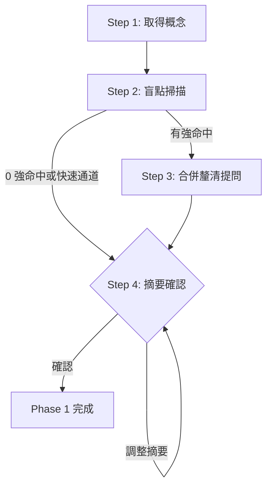

# Phase 1: 診斷釐清

從粗略概念診斷盲點、合併提問，收斂成經確認的理解摘要。

## Contract

```yaml
input:
  source: user
  type: text
  required: []   # 使用者輸入可為空；空則 Step 1 開放式追問

output:
  type: text
  schema: 理解摘要 {目標一句話, 範圍, 已鎖定事項, 殘餘假設}

checkpoint: 用戶確認理解摘要
```

## Workflow



---

## Step 1: 取得概念（處理）

使用者輸入由 SKILL.md「輸入」段承接：

- 有內容：直接作為概念文字；若為檔案路徑則讀取該檔（路徑不存在或不可讀 → 當作純文字概念處理，並在摘要註記）。
- 空：開放式問「想做什麼？一句話描述即可」。

## Step 2: 盲點掃描（處理）

載入 [blindspot-checklist.md](blindspot-checklist.md)，B1–B8 逐項比對：

- 記錄每條命中結果：**強命中**（必問）／**弱命中**（不問，記入假設）／未命中
- **快速通道**：符合 checklist 的快速通道判準 → 跳過提問直達 Step 4，摘要一行帶過
- **0 強命中** → 直接跳 Step 4

## Step 3: 合併釐清提問 [單選]

依 checklist「合併規則」把強命中項歸併後，放進**一次** AskUserQuestion——單次呼叫可帶多題（`questions` 陣列；一輪題數與選項數上限見 SKILL.md 鐵則）。選項給具體猜測（不是抽象分類）；repo 查無具體候選時，用較寬的分類選項、靠 Other 自由輸入兜底。

<action>
AskUserQuestion({
  questions: [
    {
      question: "{依合併規則組出的第 1 題}",
      header: "{≤12 字元}",
      options: [
        { label: "{具體選項 1}", description: "{說明}" },
        { label: "{具體選項 2}", description: "{說明}" }
      ],
      multiSelect: false
    },
    { question: "{第 2、3 題（若有），結構同上}" }
  ]
})
</action>

**回答後處理**：
- 記錄答案至理解摘要對應欄位
- 答案暴露新的強命中盲點 → 允許追問（總輪數上限見 SKILL.md 鐵則）
- 仍模糊的項目降級為「殘餘假設」，不再追問

## Step 4: 理解摘要 [確認]

展示四欄摘要：

| 欄位 | 內容 |
|------|------|
| 目標 | {一句話} |
| 範圍 | {repo／分支／檔案；範圍外} |
| 已鎖定 | {使用者已確認的決策與不可變事項} |
| 殘餘假設 | {未問或未答清的項目，標「（假設）」} |

<action>
AskUserQuestion({
  question: "以上理解正確嗎？",
  header: "摘要確認",
  options: [
    { label: "正確，繼續", description: "以此摘要進入下一階段" },
    { label: "需要調整", description: "指出哪裡要改" }
  ],
  multiSelect: false
})
</action>

**回答後處理**：
- 正確，繼續 → Phase 1 完成，輸出理解摘要
- 需要調整 → 依使用者指正修改摘要，重新展示確認
