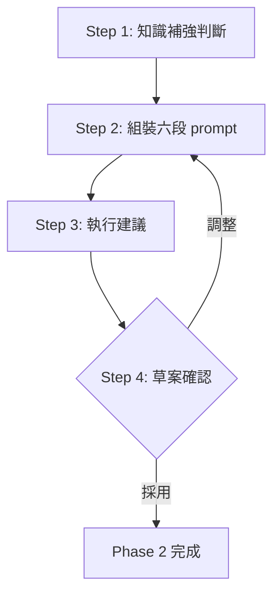

# Phase 2: 組裝產出

依理解摘要組裝六段精準 prompt 與執行方式建議。

## Contract

```yaml
input:
  source: phase-1
  type: text
  required: [理解摘要（目標／範圍／已鎖定／殘餘假設）]

output:
  type: markdown
  schema: 精準 prompt（六段）＋ 執行建議 {方式, model, 命中判準}

checkpoint: 用戶確認 prompt 草案與執行建議
```

## Workflow



---

## Step 1: 知識補強判斷（處理）

三個觸發條件，**全不命中就完全跳過（零輸出）**。輸出上限見 SKILL.md 鐵則——超過代表該開獨立研究任務，改寫進 Step 3 執行建議（「先派研究再實作」），不在此展開：

1. **專門領域**：任務涉及專門領域，且當前 repo 有對應的參考型 skill 或 rules 檔 → 不展開內容，只把該檔路徑列入 prompt「參考與遵循」段
2. **架構決策**：任務含新目錄、新依賴、跨層改動、對外介面 → 給 2–3 行取捨提示，決策點列入 prompt 的待確認事項
3. **與現況可能衝突**：要改的東西可能不存在／已有現成物 → 以唯讀方式快查（自行讀檔／搜尋；規模達派工判準時派唯讀探索 subagent，判準來源同 Step 3 分流）；查證只讀不寫，查不了就記為假設

## Step 2: 組裝六段 prompt（處理）

依 [prompt-template.md](prompt-template.md) 填空：目標與動機／範圍與現況／授權邊界／驗收條件／回報格式／參考與遵循。

- 理解摘要的「殘餘假設」以「（假設）……」寫入對應段落
- 授權邊界未確認的欄位，採 [blindspot-checklist.md](blindspot-checklist.md) 的保守預設

## Step 3: 執行建議（處理）

判準來源分流：

1. 當前 repo 存在 `.claude/ops/model-dispatch.md` → 讀其 §1 派工判準與 §3 model 對照
2. 不存在 → 用 [dispatch-fallback.md](dispatch-fallback.md)，輸出時標明「內建 fallback 判準」

輸出固定一行，格式 `建議：{方式}（{來源}）——理由：{命中的判準}`；來源標註擇一：`ops 判準`／`內建 fallback 判準`。範例：

```text
建議：主線直接做（ops 判準）——理由：已知檔案的單點修改，不符合任何派工判準
建議：派 general-purpose（model: sonnet；內建 fallback 判準）——理由：同 pattern 改 5 個檔的批次修改
```

## Step 4: 草案確認 [確認]

以 code block 展示完整六段 prompt ＋ 執行建議一行。

<action>
AskUserQuestion({
  question: "prompt 草案與執行建議如上，採用嗎？",
  header: "草案確認",
  options: [
    { label: "採用", description: "定稿，交回主流程決定交付方式" },
    { label: "調整", description: "指出要改的段落，重組後再確認" }
  ],
  multiSelect: false
})
</action>

**回答後處理**：
- 採用 → Phase 2 完成，輸出定稿 prompt 與執行建議
- 調整 → 依指正回 Step 2 重組後重新確認
