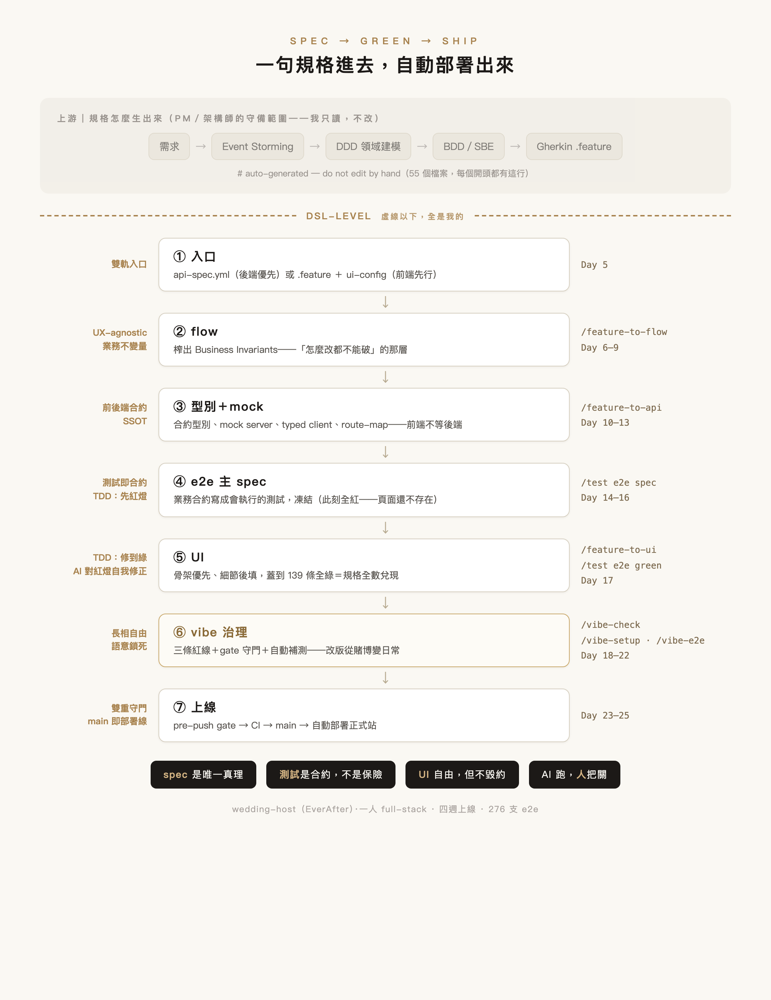
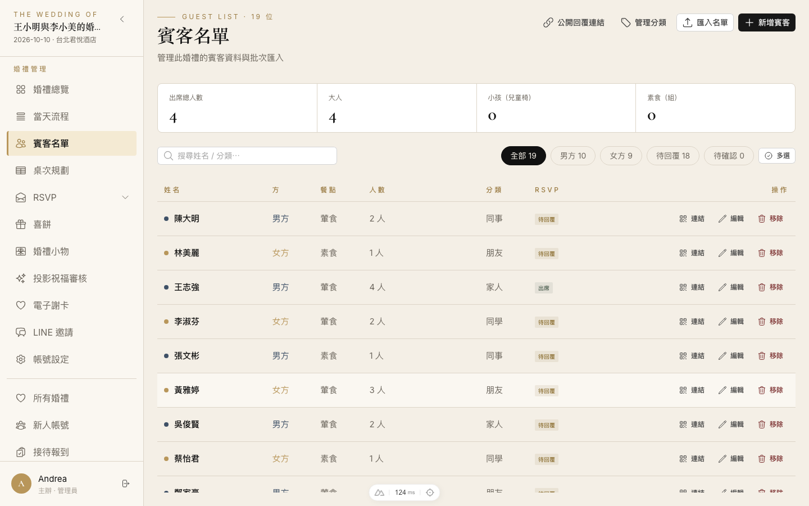
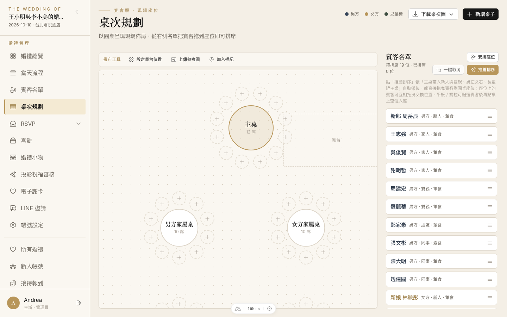

# Nuxt4-template-SDD

> 《收到自己的紅色炸彈》系列的配套 starter kit——一條前端主導的 AI 規格流水線，從一句規格走到自動部署。

這個 repo 不是 demo code。它是我用來出貨一套婚禮 SaaS 的骨架：規格怎麼進來、合約怎麼定、測試怎麼守、UI 怎麼放手改、最後怎麼上線，每一站都有一道專門擋 AI 亂寫（也擋我自己手滑）的閘門。

醜話先講：**沒有一鍵生成**。這裡沒有「描述一下需求就跑出一個系統」那種東西。你會看到很多地方是刻意讓流程慢下來、逼人先想清楚的。



## 三條信念

整套東西就長在這三句話上。看完下面所有設定檔，都會回到這裡：

- **spec 是唯一真理**——程式碼跟著規格走，不是反過來
- **測試是合約，不是保險**——綠燈的意思是「規格定義的功能真的在」，不是「一切都沒問題」
- **UI 可以自由，但不可以毀約**——顏色版面隨便改，業務語意一寸不讓

一句話總結分工：**AI 跑，人把關**。

## 流水線八站

```
入口 → flow → 型別 → mock → 測試 → UI → vibe → 上線
```

| 站 | 在幹嘛 |
|---|---|
| **入口｜規格** | 一句需求，怎麼變成 AI 和我都不會各自亂解讀的合約。這一步歪，後面全歪 |
| **flow｜資料流** | 把規格拆成看得見的資料流與 API 邊界，先想清楚東西怎麼跑，再讓 AI 動手 |
| **型別｜第一道護欄** | 用型別把合約釘死，AI 想亂接的地方，編譯器先幫我擋下來 |
| **mock｜假資料合約** | 前後端還沒接上，就先用 mock 把合約談好，兩邊各自開工也不會對不起來 |
| **測試｜煞車系統** | e2e 是擋正式站半夜炸掉的最後一道閘門——但它全綠不代表沒事 |
| **UI｜接上畫面** | 護欄都到位了，才把畫面接上去，這時候放手讓 AI 刷得快也不心慌 |
| **vibe｜有底氣地放手** | 什麼情況下才敢真的 vibe coding、讓 AI 大膽寫——那條線畫在哪 |
| **上線｜自動部署** | CI/CD 把整條線串起來，push 完剩下的交給機器 |

### 雙軌入口：我留了兩個門

進流水線有兩條路，進門之後走同一條：

| 門 | 來源 | 什麼時候走這門 |
|---|---|---|
| **門一** | `spec/api/api-spec.yml`（OpenAPI） | 後端先行。後端有自己的團隊與節奏，spec 是他們發的 |
| **門二** | `spec/gherkin-feature/*.feature` ＋ `spec/ui-config/` | 前端先行。規格從業務場景長出來，後端還沒動 |

兩門都匯流進 `/feature-to-flow`。門一存在時它就是最高真相，`npm run gen:api` 直接把 OpenAPI 產成型別。

### 載具：流程長在什麼上面

流水線不是綁在某個框架上，是綁在三個純文字的東西上：

- **skill**——給 AI 的 SOP。一個資料夾，用文字寫清楚「這一步該怎麼做、注意什麼、產出長什麼樣」。可重複、可版控、可交接
- **slash command**——skill 的觸發入口（`/feature-to-api` 這種）
- **references**——skill 執行時才按需載入的參考資料。塞太多會互相干擾，所以讓對的資料在對的步驟才進場

全部在 [`.claude/skills/`](.claude/skills/)，打開來就能讀，也能改。

## Day ↔ repo 對照

文章每篇篇尾的「📎 本篇證據」指向這裡：

| Day | 講什麼 | repo 位置 |
|---|---|---|
| 04 | 載具：skill／指令／references | [`.claude/skills/`](.claude/skills/) |
| 05 | 雙軌入口 | `spec/api/api-spec.yml`、`spec/gherkin-feature/`、`spec/ui-config/` |
| 06–08 | flow、business invariant、凍結下的正式覆寫 | `/feature-to-flow`、`spec/e2e-flows/`、[`.claude/hooks/frozen-paths-guard.mjs`](.claude/hooks/frozen-paths-guard.mjs) |
| 09 | drift 偵測與對帳 | `spec/report/route-map.yaml` |
| 10 | 型別先行 | `/feature-to-api`、`app/types/api/` |
| 11–12 | mock server ＋ typed client | `server/api/`、`server/mock/`、`app/api/*.api.ts`、[`app/composables/useHttp.ts`](app/composables/useHttp.ts) |
| 13 | sync 模式（增量同步） | `/feature-to-api`（Sync）、`spec/report/sync-report.md` |
| 14–16 | 測試即合約、主 spec 凍結 | `test/e2e/specs/`、[`playwright.config.ts`](playwright.config.ts) |
| 17 | 紅燈當工單，把 UI 蓋到綠 | `/feature-to-ui`、`/test e2e green` |
| 18–22 | vibe 治理、gate 紅燈分流 | [`.claude/rules/vibe-ui.md`](.claude/rules/vibe-ui.md)、`/vibe-check`、`/vibe-setup`、`/vibe-e2e`、[`playwright.gate.config.ts`](playwright.gate.config.ts) |
| 23 | 一個變數決定前端打誰 | `NUXT_PUBLIC_API_BASE`、[`nuxt.config.ts`](nuxt.config.ts) |
| 24 | pre-push gate ＋ CI on PR | [`.husky/pre-push`](.husky/pre-push)、[`.github/workflows/pull_request.yml`](.github/workflows/pull_request.yml)、[`scripts/docker-gate.sh`](scripts/docker-gate.sh) |
| 26 | 不交給 AI 的那幾件事 | [`.claude/ops/`](.claude/ops/) |

## Quick Start

```bash
git clone https://github.com/PinyiW0/Nuxt4-template-SDD.git
cd Nuxt4-template-SDD
npm install
npm run dev          # http://localhost:3000
```

**不需要先裝資料庫、不需要先設八個環境變數。** `npm run dev` 起來就是完整可跑的系統——前端打的是 Nuxt 自己的 `server/api/`，也就是內建 mock 後端。要接真後端是之後改一個變數的事（見[部署](#部署)）。

跑起來之後，從你自己的規格開始：

```bash
# 1. 把 .feature 放進 spec/gherkin-feature/（或把 OpenAPI 放進 spec/api/api-spec.yml）
# 2. 在 Claude Code 裡依序跑：
/feature-to-flow     # 榨出 business invariant
/feature-to-api      # 型別 + mock + typed client
/test e2e spec       # 測試合約
/feature-to-ui       # 為通過合約而生的 UI
/test e2e green      # 修到全綠
```

**第四步是改成你的技術棧。** skill 就是文字檔，打開來讀，把裡面的 Nuxt 慣例換成你的框架慣例。別把它們當咒語，它們只是容器。

## 三條上手路徑

別整套硬吞。挑一個入口：

| 你的處境 | 從哪開始 | 先拿走什麼 |
|---|---|---|
| 前端，最痛的是等後端 | Day 10–11 | 合約型別＋mock server＋typed client（獨立可用，一週見效） |
| 想導 AI 進團隊，怕它亂寫 | Day 14＋20 | 凍結的測試合約＋一道 gate——有不會說謊的驗收，AI 才敢放出去跑 |
| 專案很小 | Day 29 | 只取前半（規格→測試→UI）。治理有固定成本，小專案攤不掉 |

## 這套綁 Claude Code——不綁的部分是哪些

老實講：**slash command 與 skill 是 Claude Code 專屬機制**。你如果不用 Claude Code，`/feature-to-api` 這些指令不會動。

但綁死的只有觸發方式，不是方法本身。以下這些跟哪個 AI 工具無關，換 Cursor、Copilot、甚至純手工都成立：

- **spec 分層**（`.feature` → `.flow.md` → `.spec.ts`）與 business invariant 的萃取方式
- **凍結區政策**與它的技術強制（hook 是 Node script，`.husky/` 是 shell）
- **三份 Playwright config** 的分工：主 spec／gate／vibe
- **單變數切資料來源**的 mock↔真後端設計
- **typed client 那層**（`app/api/*.api.ts` ＋ `useHttp`），UI 不准自己碰網路

skill 檔案本身是 markdown。你要移植到別的工具，讀得懂就能改寫成那個工具的格式——內容才是重點，容器不是。

## 模板現在是空的，那些目錄要跑完指令才有

文章裡引用的 `spec/e2e-flows/04-seating.flow.md`、`test/e2e/specs/`、`server/mock/data/`，你 clone 下來會找不到。**那是對的**：它們是指令的產出物，不是模板內容。

| 模板初始就有 | 跑完指令才出現 |
|---|---|
| `spec/api/`、`spec/gherkin-feature/`、`spec/ui-config/` | `spec/e2e-flows/`、`spec/report/` |
| `app/composables/`、`app/utils/`、`app/types/api/` | `app/api/`、`app/pages/`、`app/components/`、`app/stores/` |
| `test/unit/` | `test/e2e/specs/`、`test/e2e/vibe/` |
| `.claude/`、三份 playwright config、`.husky/` | `server/api/`、`server/mock/` |

`spec/api/api-spec.yml` 與 `spec/gherkin-feature/gherkin-export.feature` 是**模板自帶的 dogfood 範例**（一套虛構的雙站流星觀測網），拿來驗 skill 產出用的。衍生新專案時換成你的真規格，或直接刪掉。

## 示範專案

系列裡從頭做到尾的那套系統是 **EverAfter**（repo：[PinyiW0/wedding-host](https://github.com/PinyiW0/wedding-host)）——我自己的婚禮 SaaS，一個人做的。它是這套流水線目前最完整的一次實跑。

2026-06-20 開第一個 commit，四週後正式站上線，到現在還在長。截至 2026-08-05：

| | |
|---|---|
| commits | 325 |
| 規格鏈 | 55 個 `.feature` → 19 份 `.flow.md` → 114 支 server 端點檔 → 21 支 typed client |
| E2E | 312 條（主 spec 20 檔 138 條 ＋ vibe 49 檔 174 條） |
| UI | 29 個頁面、21 個共用元件 |
| 後端 | 自己寫的：Drizzle ORM + Postgres、S3 相容物件儲存、Sentry |

vibe 那 174 條值得單獨講：它們不是我一條條寫的，是每次改版之後 `/vibe-setup` 分層、`/vibe-e2e` 照 pattern 生出來的。主 spec 那 138 條才是我盯著 flow 的 invariant 逐條對過的合約。

| 賓客名單 | 座位平面圖 | 謝卡公開頁 |
|---|---|---|
|  |  |  |

正式站已經跑起來了，但目前唯一的使用者是我自己——十一月婚禮當天才是真正的驗收。

---

以下是工程細節。要動手改這個模板，從這裡開始讀。

## 技術選型

> 清單之外更重要的是**理由**——接手時請先理解取捨，再動架構。

- **Nuxt 4**（SSR + Composition API）— 內建 Nitro server 讓 `server/api/` 直接當 mock 後端，是「mock／真後端單變數切換」的地基
- **Nuxt UI**（含 Tailwind v4）— 官方深整合組件庫，配 `@theme` 對接設計稿變數，省去自建設計系統
- **Pinia + persistedstate** — 集中管理跨頁狀態（auth 等），token 跨重整存活（搭配 SSR cookie 策略）
- **zod** — 在 API 邊界做 runtime 驗證，守住 mock／真後端兩來源的型別契約
- **openapi-typescript** — `spec/api/api-spec.yml` 存在時跑 `npm run gen:api` 直接產型別，OpenAPI 為最高真相
- **Playwright** — E2E 是本模板的 SSOT，業務流程合約需要真實瀏覽器跑
- **Vitest** — composables／utils 層的單元測試

### 規範工具

- [@antfu/eslint-config](https://github.com/antfu/eslint-config)（主 ESLint 規則集）
- [@nuxt/eslint](https://eslint.nuxt.com/)（Nuxt 整合，含 Vue / TS 規則）
- [Prettier](https://prettier.io/)（含 prettier-plugin-tailwindcss class 排序）
- [commitlint](https://github.com/conventional-changelog/commitlint/tree/master/%40commitlint/config-conventional) + husky（commit-msg / pre-push 守門）

### 關鍵慣例（最常踩雷，務必遵守）

- 一律 `<script setup lang="ts">`，禁止 Options API
- Props / Emits 用 type-based 宣告，禁止 runtime 宣告
- Pinia store 採框架預設 auto-import（`@pinia/nuxt`），不強制手動 import
- 讀取用 `useFetch`、寫入用 `$fetch`，禁止混用；禁止 `globalThis.$fetch` 繞過型別檢查
- 改型別以 **server 端為準**——前端不准為了讓編譯過而放寬合約
- E2E 測試 step 用中文描述
- 完成程式碼修改後必跑 `npm run eslint` + `npm run typelint`，修完才算完成

## 專案結構

```
app/
├── api/                        # typed client（*.api.ts；UI 呼叫 API 的唯一入口）
├── components|layouts|pages/   # UI（vibe 守則管轄）
├── composables|utils/          # 共用邏輯（useHttp 等）
├── stores/                     # Pinia stores
├── types/api/                  # API 合約型別
└── assets/                     # 樣式與靜態資源
server/
├── api/                        # 內建 mock 後端（NUXT_PUBLIC_API_BASE 同源時命中）
└── mock/                       # Mock 資料
spec/                           # 規格來源
├── gherkin-feature/            # .feature 業務規格（外部產出置入，凍結）
├── api/                        # OpenAPI spec（存在時為最高真相）
├── e2e-flows/                   # .flow.md 流程＋Business Invariants（凍結）
├── ui-config/                   # UI 設定與設計參考
└── report/                     # route-map.yaml、sync-report.md
test/
├── e2e/specs/                  # 主 E2E 測試合約（SSOT，凍結，勿改）
├── e2e/vibe/                   # vibe 微調驗證（不凍結，去留由人決定）
└── unit/                       # Vitest 單元測試
doc/
├── README.template.md          # 衍生專案的 README 模板
└── images/                     # 全景圖與示範截圖
.claude/                        # AI 協作制度
├── CLAUDE.md                   # 制度總索引（AI 每次 session 讀的第一份）
├── skills/                     # 指令與框架知識
├── rules/                      # 路徑觸發規範（改到對應檔才載入）
├── ops/                        # AI 作業制度
└── hooks/                      # 機械強制（凍結區守衛、server 安全檢查）
```

## 閘門：規則會被忘記，所以做成技術強制

制度不靠自律。以下每一條都是機器在擋：

| 閘門 | 機制 | 擋什麼 |
|---|---|---|
| 凍結區 | `.claude/hooks/frozen-paths-guard.mjs`（PreToolUse，含 Bash 與 subagent） | 修改既有的 `test/e2e/specs/`、`spec/gherkin-feature/`、`spec/e2e-flows/`（新增放行、唯讀不限） |
| server 安全慣例 | `.claude/hooks/server-security-guard.mjs`（PostToolUse） | 寫完 server 檔立刻檢查授權／輸入驗證 |
| commit 訊息 | `.husky/commit-msg` + commitlint | 不符 Conventional Commits |
| 機敏值進版控 | `.husky/pre-commit` | staged `.env*` 中 `KEY`／`SECRET`／`TOKEN`／`PASSWORD`／`CREDENTIAL` 有值 |
| 業務合約回歸 | `.husky/pre-push`（＝ `npm run test:gate`） | 破壞 Business Invariant 的 push；只動文件／設定時自動略過 |
| 環境會說謊 | `.github/workflows/pull_request.yml` | 本機過了但 CI 不過的（unit / build / lint / typecheck 都在 PR 上跑） |

兩道關的分工：**pre-push 防我手滑，CI 防我環境說謊。**

### Vibe UI 守則（改 UI 必讀）

UI 可以自由微調——顏色、間距、layout、按鈕形式、table/card 呈現、折疊、動畫、新增頁面，改的時候不用問任何人。但**不得破壞 Business Invariants**（定義在各 `.flow.md` 開頭段）：

1. **業務實體要能被使用者認出來**——賓客叫「王小明」，不是 `guest-042`
2. **業務狀態文字要保留語意**——「已報到」不能退化成一個色點
3. **業務操作要有可達路徑**——不一定是按鈕，右鍵／拖曳／長按都合法，但「取消座位」要做得到也找得到

驗證順序：`/vibe-check`（gate 綠燈）→ `/vibe-setup`（分層，看哪些改動需要補測）→ `/vibe-e2e`（產 vibe spec 並跑）。

**紅燈分流**是這裡最關鍵的一條：紅在 `test/e2e/specs/` ＝ 毀約，只能修產品、不能改測試；紅在 `test/e2e/vibe/` ＝ 行為變了，修產品或更新該 spec 都合法，由人拍板。合約保底線，紀錄保細節。

三份 Playwright config：`playwright.config.ts`（主 spec）、`playwright.gate.config.ts`（守門＝主 spec＋vibe spec）、`playwright.vibe.config.ts`（只跑 vibe）。

### 路徑觸發規範

`.claude/rules/` 下的規範不預讀，改到對應路徑才載入，避免 context 被無關規則佔滿：

| 規範 | 觸發路徑 |
|---|---|
| `code-quality.md` | `app/`、`server/` |
| `server-security.md` | `server/` |
| `frontend-security.md` | `app/` 的 UI／store／composable |
| `ui-conventions.md`、`vibe-ui.md` | `pages/`、`components/`、`layouts/` |
| `framework-skills.md` | `.vue`／store／composable |
| `frozen-paths.md` | 凍結區 |
| `i18n-locale-policy.md` | `i18n/` 翻譯檔、`.husky/pre-push` |

> 有個實測到的坑要講：paths 觸發的 rules **不會注入 subagent**。所以真正的防線是 hook，不是規則檔；派工給 subagent 時要在 prompt 裡明文指讀對應規範。

### 不交給 AI 的三件事

`.claude/ops/` 是這套流程的作業制度，核心是三個原則：**指揮官不下場**（粗活派 subagent，主 session 保留判斷力與 context）、**驗證不自驗**（產出者不當審查者）、**隨做隨存**（結論寫進檔案，不是留在對話裡）。

底下還有一條更硬的線——人保留三件事：定目標（脈絡只能人餵）、看風險（做決定的人必須會痛，痛覺沒辦法外包）、做取捨（「做得到」不等於「值得做」）。

## 指令總表

| 指令 | 用途 | 前置條件 |
|---|---|---|
| `/new-issue` | 建 issue + 綁定 linked 分支 | gh 已認證 |
| `/sdd-status` | 唯讀盤點七站進度＋建議下一步 | 無 |
| `/feature-to-flow` | Feature → `.flow.md` | `.feature` 已放入 `spec/gherkin-feature/` |
| `/feature-to-api` | Feature／OpenAPI → 型別 + Mock API + typed client | `.flow.md` 已放入 `spec/e2e-flows/` |
| `/test e2e spec` | `.flow.md` → 測試合約 `.spec.ts` | 同上 |
| `/feature-to-ui` | 為通過合約而生的 UI（骨架優先、細節後填） | `/feature-to-api` 已完成 |
| `/test e2e green` | 跑 E2E → 修 UI → 重跑，直到全過 | spec 與 UI 都在 |
| `/vibe-check` | Gate 守門（主 spec + vibe spec） | vibe 完 UI 後、commit 前 |
| `/vibe-setup` | 把 vibe diff 分層並標出命中的測試 pattern | `/vibe-check` 綠燈 |
| `/vibe-e2e` | 生成 `test/e2e/vibe/*.spec.ts` 並執行 | `/vibe-check` 綠燈 |
| `/sdd-review` | 審查 diff 的框架語意與邏輯安全 | 有 `.vue`／store／server 改動 |
| `/nuxt-ui` | 載入 NuxtUI 官方文檔再動手，不憑記憶猜 API | 無 |
| `/verify-ac` | 對照 issue 驗收標準逐條驗收，未過自動修（上限 2 輪），結果勾回 issue | issue 有 `## 驗收標準`、編號可解析 |
| `/commit` | 依 SDD 階段分群產生 commit | 有改動 |
| `/pr` | push → PR 草案 → 建 PR | 已 commit、不在 main |
| `/pr-feedback` | 爬 PR review 留言，分類報告後就地改（不 commit／push／發言） | PR 已開 |
| `/review-loop` | push 後自動請 Copilot review、輪詢、修「必修」、回覆，直到共識才通知（不 merge） | PR 已開、工作區乾淨 |
| `/ship` | 收尾一條龍：六層關卡（紅燈自動修）→ AC 驗收 → commit → PR，只停一次 | 有改動、不在 main |

另有兩類非主線能力：`/requirement-breakdown` 走需求拆解線（rough 需求 → user story + 時間線 + 工種歸屬），與開發線不耦合；`vue`／`nuxt`／`pinia`／`realtime`／`streaming` 是知識型 skill，改到對應檔案時自動載入，負責裁決框架語意。

### sync 模式：後端又改規格了，我不重寫

後端發新 spec 時不重跑整條線，只走這段：

```
新 api-spec 置入 → /feature-to-api（Sync）→ /test e2e spec → /feature-to-ui（Sync）→ /test e2e green → gate 回歸
```

它比對新舊差異、只動受影響的部分，並落一份 `spec/report/sync-report.md` 記這次動了哪些端點、連帶改了哪些型別和 mock。人的確認點只剩「看 git diff」。

## 環境與指令

- node : `>=22.12.0`（見 package.json `engines`）
- 編輯器 : VSCode ＋ [Tailwind CSS IntelliSense](https://marketplace.visualstudio.com/items?itemName=bradlc.vscode-tailwindcss)、[Vue - Official](https://marketplace.visualstudio.com/items?itemName=Vue.volar)、[ESLint](https://marketplace.visualstudio.com/items?itemName=dbaeumer.vscode-eslint)、[Goto definition alias](https://marketplace.visualstudio.com/items?itemName=antfu.goto-alias)

```
npm install            // 安裝套件
npm run dev            // 啟動 dev（預設 mock，http://localhost:3000）
npm run build          // SSR 打包
npm run generate       // SSG 打包
npm run preview        // 啟動打包後專案
npm run eslint         // ESLint 檢查
npm run typelint       // 型別檢查（nuxi typecheck）
npm run gen:api        // OpenAPI → API 型別（讀 spec/api/api-spec.yml）
npm run test:unit      // Vitest 單元測試
npm run test:e2e       // Playwright 主 E2E 合約（--headed／--ui 變體見 package.json）
npm run test:gate      // 守門（主 spec＋vibe spec，pre-push 跑同一份）
npm run test:vibe      // 只跑 vibe spec
```

## 多 issue 並行開發（git worktree）

一個 issue 一個 worktree，多個 CLI session 才不會在同一目錄互踩（source、`.nuxt`、git 分支天然隔離）：

```bash
git worktree add ../nuxt4-template-issue-40 'feature/#40-xxx'
cd ../nuxt4-template-issue-40 && npm install
```

- `.env` 是 git tracked，worktree checkout 自帶，無需手動複製
- E2E dev server port 由 worktree 路徑自動推導（3100–3499，gate/vibe config 繼承同一 base 推導）：各 worktree 不互撞，同 worktree 重跑重用同一 server；萬一兩個 worktree 撞到同一個 port（機率 1/400），換個目錄名即換 port
- port 隔離只管 E2E 起的 server；**手動 `npm run dev` 固定跑 3000**，多個 worktree 同時手動 dev 要自帶 port 錯開：`npm run dev -- --port 3001`
- pre-push gate 走 Docker（`scripts/docker-gate.sh`，production build 隔離 + ephemeral port），多 session 同時 push 也不互撞；Docker 沒開時自動 fallback 本機模式並警告
- 兩條線都動了 API 層時，`spec/report/route-map.yaml`（機器產的單檔 SoT）merge 必衝突：**不手動解衝突**——晚合併的分支先 rebase main，再重跑 `/feature-to-api` 重新產出
- 收工清理：`git worktree remove ../nuxt4-template-issue-40`

## 部署

用**一個變數** `NUXT_PUBLIC_API_BASE` 切換資料來源，不靠 `NODE_ENV`、不靠多份 config：

- **同源 `/api`（預設）** → 請求打回 Nuxt 自己 → 命中內建 mock（`server/api/`）
- **絕對 URL** → 請求打到真後端 → 接真實 DB

同一份 build，程式碼一行不動。**fail-safe：mock 是預設**，要碰真資料一定得刻意改設定。

```bash
# 本機 dev（mock，零設定）
npm install
npm run dev                                            # http://localhost:3000

# 本機 dev 接真後端（比對真資料／debug 線上）
NUXT_PUBLIC_API_BASE=https://<真後端位址>/api npm run dev

# Docker（讀 .env 的 PROJECT_NAME／IMAGE_TAG／HOST_PORT）
docker compose build
docker compose up -d                                   # http://localhost:${HOST_PORT}（預設 3000）
```

### 上線前安全檢查

每個專案上線前過一遍（無 auth 專案只看最後一條；範本與依據見 `.claude/skills/feature-to-api/references/auth-scaffold.md` §4b）：

- [ ] 密鑰啟動守衛 `server/plugins/00.security-guard.ts` 的 `REQUIRED_SECRETS` 已登記全部真密鑰（§4b①）
- [ ] 敏感端點限流已套：login；fileUpload 專案含 upload／presign（§4b②）
- [ ] 三個基礎安全標頭在 `nuxt.config.ts` 的 `routeRules`（§4b③）
- [ ] 嚴格 CSP 已評估並記錄結論——採用或不採用＋理由（模板預設不帶：需 nonce 基建、逐專案評估）

**CI 憑證面**（repo 有設 Actions secrets 就要看）：

- [ ] `.github/workflows/` 下所有 `uses:` 釘 commit SHA，非可變 tag——tag 可被上游移動，惡意版本會在持有 secrets 的 job 內執行。升 action 版本時連同行末註解的版本號一起更新
- [ ] workflow 觸發用 `pull_request` 而非 `pull_request_target`——後者會把 secrets 交給 fork PR 的程式碼，是公開 repo 最典型的 token 竊取破口
- [ ] **新增外部協作者前**重新評估 `sdd-review.yml`：對同 repo 分支的 PR，該 job 持有 `CLAUDE_CODE_OAUTH_TOKEN` 且 Claude 會讀 PR diff。其 `--allowed-tools` 含 `Read` 與留言工具，惡意 diff 理論上可透過 prompt injection 誘導把環境變數寫進公開留言。個人 repo（無外部 push 權限）此風險不成立，開放協作即成立

### 設定檔職責

| 檔案 | 進版控 | 內容 |
|------|--------|------|
| `.env` | ✅ | `PROJECT_NAME` / `IMAGE_TAG` / `HOST_PORT`；`NUXT_PUBLIC_API_BASE` 預設 `/api`＝mock |
| `docker-compose.yml` | ✅ | 唯一服務定義；名稱與 tag 由 `.env` 控制，換專案只改 `.env` 不動此檔 |
| `nuxt.config.ts` | ✅ | `runtimeConfig` 預設值（`apiBase`、`apiEnvelope`），正式由 env 覆蓋 |

> **鐵則**：committed 的 `.env` **零機敏**。機敏值只走 runtime 注入，絕不進版控；`.env` 不進 image（已被 `.dockerignore` 排除），只在 host 端被 docker-compose 讀取。
> `.env` 是刻意加入 git 追蹤的（`.gitignore` 的忽略不影響已追蹤檔），勿 `git rm --cached` 移出——worktree「checkout 自帶 `.env`」靠的就是它。
> 這條鐵則由 `.husky/pre-commit` 機械強制：staged 的 `.env*` 中，變數名帶 `NUXT_PRIVATE_` 前綴或含 `KEY`／`SECRET`／`TOKEN`／`PASSWORD`／`CREDENTIAL` 字段者，**值非空即擋下 commit**（值為空的 passthrough 宣告合法）。誤判可 `git commit --no-verify`。
> 後端回 envelope（`{ success, data, message, meta }`）維持預設即可；裸 schema 後端設 `NUXT_PUBLIC_API_ENVELOPE=false`（`useHttp` 依此決定拆不拆外層）。

### 機敏值注入（可選）

`docker-compose.yml` 已示範對 `NUXT_PRIVATE_GOOGLE_SHEET_KEY` 做同名 passthrough——部署機 export 後再起服務，不進版控也不進 image：

```bash
export NUXT_PRIVATE_GOOGLE_SHEET_KEY='真正的 key'
docker compose up -d
```

要啟用時需在 `nuxt.config.ts` 的 `runtimeConfig` 補上對應 server-side key（模板僅留 passthrough 示範，未定義該 key）；其他機敏值照此模式增加。

### 版本號／回滾

image 以 `.env` 的 `IMAGE_TAG` 標記（`${PROJECT_NAME}-frontend:${IMAGE_TAG}`），與 git 版本綁定即可回滾：

```bash
IMAGE_TAG=$(git describe --tags --always) docker compose build   # build 時綁 git 版本
IMAGE_TAG=<舊版 tag 或 sha> docker compose up -d                 # image 還在時直接回滾，不必重 build
```

## 衍生專案

要拿這個模板開新專案：複製 [`doc/README.template.md`](doc/README.template.md) 到你的專案根目錄改名 `README.md`，照裡面的 📝 註解填。那份模板已經把技術選型、慣例、部署、GitHub 流程都寫好了，你只要補專案自己的功能模組與技術決策。
